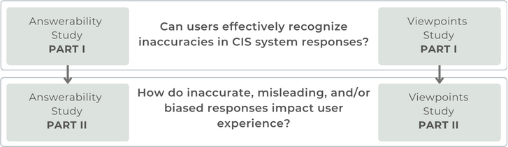

# Can Users Detect Biases or Factual Errors in Generated Responses in Conversational Information-Seeking?

## Summary

Information-seeking dialogues span a wide range of questions, from simple factoid to complex queries that require exploring multiple facets and viewpoints. When performing exploratory searches in unfamiliar domains, users may lack background knowledge and struggle to verify the system-provided information, making them vulnerable to misinformation. We investigate the limitations of response generation in conversational information-seeking systems, highlighting potential inaccuracies, pitfalls, and biases in the responses. The study addresses the problem of *query answerability* and the challenge of *response incompleteness*. Our user studies explore how these issues impact user experience, focusing on users' ability to identify biased, incorrect, or incomplete responses. We design two crowdsourcing tasks to assess user experience with different system response variants, highlighting critical issues to be addressed in future conversational information-seeking research. Our analysis reveals that, from a user perspective, it is easier to detect response incompleteness than query answerability. However, user satisfaction is only associated with factual correctness, and not with diversity.

## Crowdsourcing Tasks

In the proposed crowdsourcing tasks we investigate if users can recognize inaccuracies in CIS system responses and how these inaccuracies impact the user experience. We conduct two crowdsourcing experiments that investigate the problems of: 

1. query answerability in the *answerability study* and 
2. response incompleteness in the *viewpoints study*. 

Users are presented with a set of queries together with responses and asked to assess the quality of the answers, as well as their overall satisfaction.

The methodology, execution, and design of the crowdsourcing experiments are covered in detail [here](crowdsourcing_task_design/README.md).

## Data

For each user study, we select a set of ten queries that are susceptible to one of the identified problems. For each query, we manually create different variants of responses differing in terms of *controlled dimensions*:

- (1) factual correctness and (2) source presence/validity in the *answerability study*
- (1) viewpoint diversity and (2) balanced viewpoint presentation in the *viewpoints study*

The data used as an input to our crowdsourcing tasks is covered in detail [here](data/README.md).

## Results

The results of our crowdsourcing tasks and the data analysis are covered in details [here](results/README.md).
