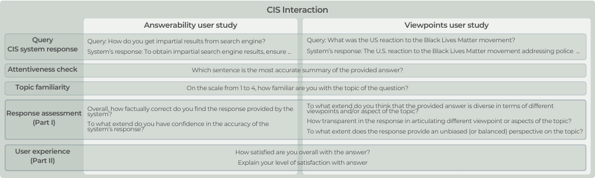
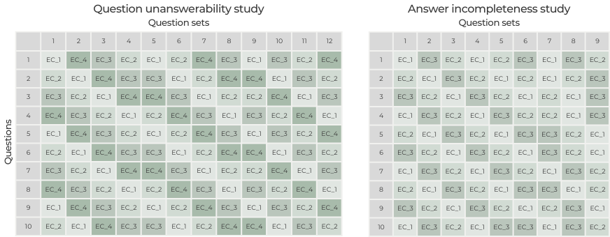

# User Studies

## Designs

The design of the *answerability study* and the *viewpoints study* followed the same principle, where workers were asked to complete one HIT, consisting of ten query-response pairs. The task consisted of 

- a) HIT instructions
- b) ten CIS interactions
- c) demographics questionnaire

Each user study is decomposed into multiple subsections using independent CIS interactions. Each CIS interaction contains one query-response pair, followed by: 
- (1) a corresponding attentiveness check, 
- (2) a measurement of the user's familiarity with the topic, 
- (3) a CIS response assessment (Part I), 
- (4) a measurement of user experience (Part II).

Questions provided to crowd workers in our user studies:

The instructions followed by first CIS interaction for the *answerability study* can be found [here](answerability-design.pdf) and for the *viewpoints study* [here](viewpoints-design.pdf).

## Question Sets

Both our studies follow Graeco-Latin square design, that ensures the rotation and randomization of queries and response variants, as well as no overlap between HITs. Each query-response pair appears in at least 3 different query sets. It gives us 12 (3 x 4 responses for each query) different question sets for the *answerability study* and 9 for the *viewpoints study*. Queries appear in the question sets in a random order. Each query set is answered by 3 different crowd workers to avoid repeated judgments that reduce the reliability of the study.

The input data and the construction of question sets is covered in details [here](../data/input/README.md).