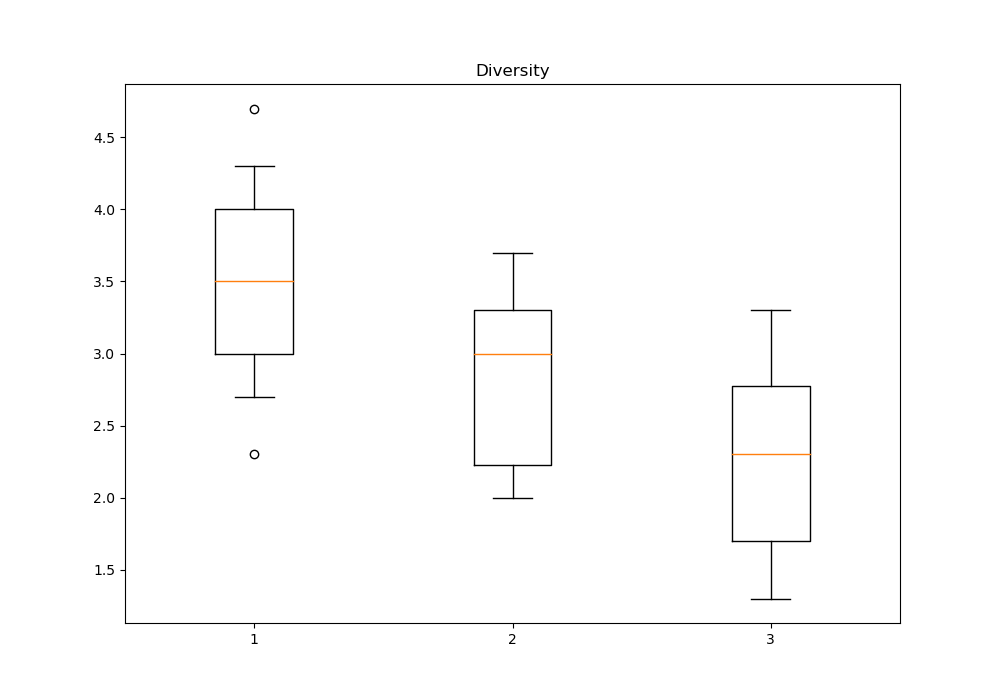
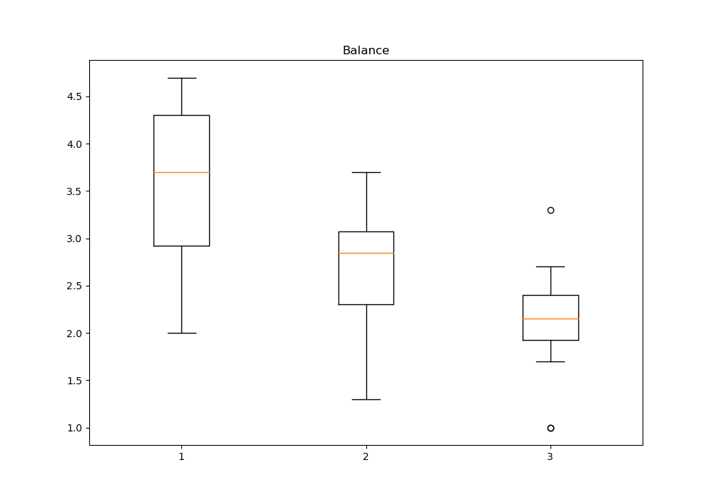

# Responses

Creating diverse response variants is a collaborative effort, with manual crafting supported by ChatGPT (the prompts used with ChatGPT are provided as an additional column in the input files linked below). The responses are based on the five most relevant passages according to the scores provided in the TREC CAsT datasets. For every user study, we identify two primary dimensions for generating system responses, recognizing that these dimensions are not exhaustive. Nevertheless, our hypothesis posits that varying the responses along these dimensions will give us the means to answer our research questions effectively. 

## Answerability Study

The query answerability in CIS most likely results in factual errors and hallucinations. Therefore, we are mostly interested in the following two dimensions of the responses:
1. factual correctness of the included information
2. the presence and validity of the source of the information

The accurate response contains factually correct information along with the source. Whereas, the flawed response contains factually incorrect or unsupported information without the source or with an invalid source. The flawed response may contain various factual inconsistencies, such as negation and number, entity, or antonym swaps, as well as fully hallucinated content not supported by any source information. Invalid source indicate a mismatch between the name of the source and its content, the source relevant to the topic but not supporting the specific facts in the response, or the source for which the link is corrupted. The responses generated for the *answerability study* can be found [here](answerability_data.csv).

## Viewpoints Study

In this user study, we focus on a widely understood diversity of viewpoints. It is left to the user to judge whether the expressed viewpoints are diverse enough or not. While investigating queries that are likely to result in incomplete responses, we are interested in the following two dimensions:
1. diversity of the response in terms of different viewpoints and/or aspects mentioned
2. balance in the amount of information provided for each viewpoint and/or aspect

The accurate response equally covers various points of view and/or aspects of the topic. The flawed response only mentions one point of view and/or aspect of the topic or mentions several but elaborates only on one of them. The last experimental condition with a lack of both diversity and balance makes no sense because the text discussing only one point of view can not be unbalanced. The responses generated for the *viewpoints study* can be found [here](viewpoints_data.csv).

#### Answers Quality Assurance

We introduce an additional step for *viewpoints study* to validate the understanding of our proposed response dimensions. This additional step for optimizing queries and responses is introduced only for the *viewpoints study* because the problem of controversy and topic broadness is more subjective than the problem of answerability. This step will help us identify question-answer pairs that are not good representatives of the problem.

We select 12 questions and manually create 3 variants of the response for each of them. We create small surveys where expert annotators are presented with three topics and lists of recommended resources used to generate the answers. The expert annotators are asked to explore the topics to become familiar with basic concepts and problems related to each topic. We provide them with the links to the entire web pages or articles, without information about the specific passages that were used for generating the response. Then, they are presented with different variants of the answers to the questions about explored topics and asked to judge the diversity and balance of each of the provided question-answer pairs. For each question-answer pair used in *answerability study*, we collect scores between 1-5 for diversity and balance from three expert annotators (12 annotators in total). We opted to release these surveys on the crowdsourcing platform because we wanted to have control over the time spent by the participants on actually exploring the topics. 
We employed PhD candidate for their academic skills in exploring new domains due to the nature of their work. One expert annotator's answers were excluded from the study due to an incorrect understanding of the task reported in the feedback after task submission. 

The setup of the study encourages exploring the topics before assessing the questions. Therefore, the obtained scores can be assumed to come from users with high familiarity with the topics (experts). We focus on the outliers in the scores for A1 (in theory the best answer - multiple viewpoints, balanced) and A3 (in theory the worst answer - single viewpoints, imbalanced). We exclude questions for which the score for A1 is the furthest below the 1st quartile in terms of diversity and the question for which the score for A3 is the furthest above the 3rd quartile in terms of balance. These intuitively correspond to the question where A1 is not diverse enough, and A3 is too balanced. We exclude the query for which the response variant corresponding to the first experimental condition (multiple viewpoints covered to the same extend) is judged as not diverse enough and the query for which the response variant corresponding to the third experimental condition (single viewpoint mentioned and covered) is judged as too balanced. This additional step aims at improving the quality of input data for the user study, ensuring meaningful differences between answer variants and similar quality of answers between the questions. The results of our response validation questionnaire can be found [here](data/responses/viewpoints_response_validation/answer_validation.csv).

Diversity       |  Balance
:-------------------------:|:-------------------------:
  |  
