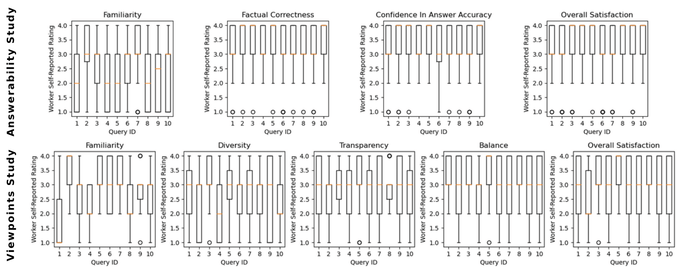

# Results of Quantitative Analysis

The following sections provides the results reported in the paper along with the scripts used to generate the numbers.

## One-way ANOVA

### One-way ANOVA for query

Answerability Study:

| Dependent Variable | Independent Variable(s) | p-value | Effect Size |
| --- | --- | --- | --- |
| Familiarity | Query | 0.0 | M |
| Factual Corr. | Query | 0.0 | S |
| Conf. in Answer Acc. | Query | 0.019 | S |
| Overall Satisfaction | Query | 0.0 | S |

Viewpoints Study:

| Dependent Variable | Independent Variable(s) | p-value | Effect Size |
| --- | --- | --- | --- |
| Familiarity | Query | 0.0 | L |
| Diversity | Query | 0.338 | -  |
| Transparency | Query | 0.458 | -  |
| Balance | Query | 0.027 | S |
| Overall Satisfaction | Query | 0.005 | S |

### One-way ANOVA for the background knowledge

Answerability Study:

| Dependent Variable | Independent Variable(s) | p-value | Effect Size |
| --- | --- | --- | --- |
| Factual Correctness | Familiarity | 0.005 | S |
| Conf. in Answer Acc. | Familiarity | 0.0 | S |
| Overall Satisfaction | Familiarity | 0.0 | M |

Viewpoints Study:

| Dependent Variable | Independent Variable(s) | p-value | Effect Size |
| --- | --- | --- | --- |
| Diversity | Familiarity | 0.375 | -  |
| Transparency | Familiarity | 0.478 | -  |
| Balance | Familiarity | 0.639 | -  |
| Overall Satisfaction | Familiarity | 0.378 | -  |

The results are generated using [this script](../../scripts/data_analysis/anova.py) and the following command:

`` python -m scripts.data_analysis.quantitative_analysis --type one-way ``

### Power Analysis

The power analysis, employing results of one-way ANOVA with the experimental condition as an independent variable and the user-reported values for the main response dimension (factual correctness for the *answerability study* and diversity for the *viewpoints study*) as a dependent variable, was conducted using data collected in the first run. We used the script *future.sample.1wayanova* available [here](https://waseda.app.box.com/v/SIGIR2016PACK) to calculate the power with the following parameters: *F* equal to the corresponding value from the tables above, *m* equal to the number of variants/experimental conditions in user study, and *n* equal to number of workers looking at each variant per topic (9 in the first run).

For the *answerability study*:
- Cohen's f effect size of experimental condition on factuality: 0.11
- Number of workers as a result of power analysis for small effect size (0.1): 1094.17
- Number of workers as a result of power analysis for large effect size (0.4): 72.17

For the *viewpoints study*:
- Cohen's f effect size of experimental condition on diversity: 0.49
- Number of workers as a result of power analysis for small effect size (0.1): 966.47
- Number of workers as a result of power analysis for large effect size (0.4): 63.31

The results indicate that an additional five workers per HIT are required to observe a statistically significant effect of experimental condition on the factual correctness in the *answerability study*, while the 3 workers we initially used in the *viewpoints study* are shown to be sufficient. Additional data for the *answerability study* is collected in the second run with the same worker requirements and rewards. 

The results of the power analysis can be generated using [this script](../../scripts/data_analysis/anova.py) and the following command:

`` python -m scripts.data_analysis.quantitative_analysis --type power-analysis ``

## Two-way ANOVA

### Two-way ANOVA for the interactions between user-judged and controlled response dimensions

Answerability Study:

| Dependent Variable (User-Judged) | Independent Variable(s) (Controlled) | p-value | Effect Size |
| --- | --- | --- | --- |
| Factual Correctness | Contr. Fact. Corr. | 0.014 | - | 
| Factual Correctness | Contr. Source |  0.664 | -  | 
| Factual Correctness | Contr. Fact. Corr. * Contr. Source |  0.267 | -  | 
| Conf. in Answer Acc. | Contr. Fact. Corr. | 0.244 | -  | 
| Conf. in Answer Acc. | Contr. Source |  0.763 | -  | 
| Conf. in Answer Acc. | Contr. Fact. Corr. * Contr. Source |  0.575 | -  | 
| Overal Satisfaction | Contr. Fact. Corr. | 0.306 | -  | 
| Overal Satisfaction | Contr. Source |  0.394 | -  | 
| Overal Satisfaction | Contr. Fact. Corr. * Contr. Source |  0.267 | -  | 

Viewpoints Study:

| Dependent Variable (User-Judged) | Independent Variable(s) (Controlled) | p-value | Effect Size |
| --- | --- | --- | --- |
| Diversity | Contr. Diversity | 0.0 | M | 
| Diversity | Contr. Balance | 1.0 | -  | 
| Diversity | Contr. Diversity * Contr. Balance | 0.0 | M | 
| Transparency | Contr. Diversity | 0.0 | M | 
| Transparency | Contr. Balance | 1.0 | -  | 
| Transparency | Contr. Diversity * Contr. Balance | 0.0 | M | 
| Balance | Contr. Diversity | 0.0 | S | 
| Balance | Contr. Balance | 1.0 | -  | 
| Balance | Contr. Diversity * Contr. Balance | 0.0 | S | 
| Overall Satisfaction | Contr. Diversity | 0.0 | S | 
| Overall Satisfaction | Contr. Balance | 1.0 | -  | 
| Overall Satisfaction | Contr. Diversity * Contr. Balance | 0.0 | M | 

The results are generated using [this script](../../scripts/data_analysis/anova.py) and the following command:

`` python -m scripts.data_analysis.quantitative_analysis --type two-way ``

## Three-way ANOVA

### Three-way ANOVA for the interactions between query and controlled response dimensions

Answerability Study:

| Dependent Variable (User-Judged) | Independent Variable(s) (Controlled) | p-value | Effect Size |
| --- | --- | --- | --- |
| Factual Correctness | Query | 0.0 | S |
| Factual Correctness | Contr. Fact. Corr. * Query | 0.002 | S |
| Factual Correctness | Contr. Source * Query | 0.048 | - |
| Factual Correctness | Contr. Fact. Corr. * Contr. Source * Query | 0.439 | -  |
| Conf. in Answer Acc. | Query | 0.015 | S |
| Conf. in Answer Acc. | Contr. Fact. Corr. * Query | 0.0 | S |
| Conf. in Answer Acc. | Contr. Source * Query | 0.118 | -  |
| Conf. in Answer Acc. | Contr. Fact. Corr. * Contr. Source * Query | 0.341 | -  |
| Overall Satisfaction | Query | 0.0 | S |
| Overall Satisfaction | Contr. Fact. Corr. * Query | 0.0 | S |
| Overall Satisfaction | Contr. Source * Query | 0.339 | -  |
| Overall Satisfaction | Contr. Fact. Corr. * Contr. Source * Query | 0.598 | -  |

Viewpoints Study:

| Dependent Variable (User-Judged) | Independent Variable(s) (Controlled) | p-value | Effect Size |
| --- | --- | --- | --- |
| Diversity | Query | 0.147 | S  |
| Diversity | Contr. Diversity * Query | 0.101 | S  |
| Diversity | Contr. Balance * Query | 1.0 | -  |
| Diversity | Contr. Diversity * Contr. Balance * Query | 0.016 | S |
| Transparency | Query | 0.35 | -  | 
| Transparency | Contr. Diversity * Query | 0.582 | -  | 
| Transparency | Contr. Balance * Query | 1.0 | -  | 
| Transparency | Contr. Diversity * Contr. Balance * Query | 0.689 | -  | 
| Balance | Query | 0.012 | S |
| Balance | Contr. Diversity * Query | 0.559 | -  |
| Balance | Contr. Balance * Query | 1.0 | -  |
| Balance | Contr. Diversity * Contr. Balance * Query | 0.316 | -  |
| Overall Satisfaction | Query | 0.001 | M |
| Overall Satisfaction | Contr. Diversity * Query | 0.599 | -  |
| Overall Satisfaction | Contr. Balance * Query | 1.0 | -  |
| Overall Satisfaction | Contr. Diversity * Contr. Balance * Query | 0.034 | S |

### Three-way ANOVA for the interactions between familiarity and controlled response dimensions

Answerability Study:

| Dependent Variable (User-Judged) | Independent Variable(s) (Controlled) | p-value | Effect Size |
| --- | --- | --- | --- |
| Fact. Corr. | Familiarity | 0.006 | S |
| Fact. Corr. | Contr. Fact. Corr. * Familiarity | 0.962 | -- |
| Fact. Corr. | Contr. Source * Familiarity | 0.275 | -- |
| Fact. Corr. | Contr. Fact. Corr. * Contr. Source * Familiarity | 0.56 | -- |
| Conf. in Answer Acc. | Familiarity | 0.0 | S |
| Conf. in Answer Acc. | Contr. Fact. Corr. * Familiarity | 0.894 | -- |
| Conf. in Answer Acc. | Contr. Source * Familiarity | 0.556 | -- |
| Conf. in Answer Acc. | Contr. Fact. Corr. * Contr. Source * Familiarity | 0.348 | -- |
| Overall Satisfaction | Familiarity | 0.0 | M |
| Overall Satisfaction | Contr. Fact. Corr. * Familiarity | 0.544 | -- |
| Overall Satisfaction | Contr. Source * Familiarity | 0.381 | -- |
| Overall Satisfaction | Contr. Fact. Corr. * Contr. Source * Familiarity | 0.777 | -- |

Viewpoints Study:

| Dependent Variable (User-Judged) | Independent Variable(s) (Controlled) | p-value | Effect Size |
| --- | --- | --- | --- |
| Diversity | Familiarity | 0.816 | -- |
| Diversity | Contr. Diversity * Familiarity | 0.056 | S |
| Diversity | Contr. Balance * Familiarity | 1.0 | -- |
| Diversity | Contr. Diversity * Contr. Balance * Familiarity | 0.628 | -- |
| Transparency | Familiarity | 0.788 | -- |
| Transparency | Contr. Diversity * Familiarity | 0.257 | -- |
| Transparency | Contr. Balance * Familiarity | 1.0 | -- |
| Transparency | Contr. Diversity * Contr. Balance * Familiarity | 0.316 | -- |
| Balance | Familiarity | 0.89 | -- |
| Balance | Contr. Diversity * Familiarity | 0.325 | -- |
| Balance | Contr. Balance * Familiarity | 1.0 | -- |
| Balance | Contr. Diversity * Contr. Balance * Familiarity | 0.242 | -- |
| Overall Satisfaction | Familiarity | 0.358 | -- |
| Overall Satisfaction | Contr. Diversity * Familiarity | 0.187 | -- |
| Overall Satisfaction | Contr. Balance * Familiarity | 1.0 | -- |
| Overall Satisfaction | Contr. Diversity * Contr. Balance * Familiarity | 0.38 | -- |

The results are generated using [this script](../../scripts/data_analysis/anova.py) and the following command:

`` python -m scripts.data_analysis.quantitative_analysis --type three-way ``

## Pearson correlation

Answerability Study:

| Response Dimension | Correlation Coefficient |
| --- | --- |
| Factual Correctness |  0.634  |
| Conf. in Answer Acc. |  0.660  |

Viewpoints Study:

| Response Dimension | Correlation Coefficient |
| --- | --- |
| Diversity |  0.720 |
| Transparency |  0.727  |
| Balance |  0.785  |

The results are generated using [this script](../../scripts/data_analysis/anova.py) and the following command:

`` python -m scripts.data_analysis.quantitative_analysis --type pearson ``

## Data distribution

We show that user-judged satisfaction ratings are typically concentrated around higher values of the scale. The distribution of user-judged response dimensions per query for both user studies can be generated using [this script](../../scripts/data_analysis/data_distribution.py) and the following command:

`` python -m scripts.data_analysis.data_distribution ``

## Demographic information

Demographic information from both user studies can be obtained by running [this script](../../scripts/data_analysis/demographic_information.py) using the following command:

`` python -m scripts.data_analysis.demographic_information ``

| Demographic Information | Option |Answerability User study | Viewpoint User study |
| --- | --- | --- | --- |
| age | 18-30 | 34 | 3 |
| age | 31-45 | 35 | 12 |
| age | 46-60 | 19 | 10 |
| age | 60+ | 7 | 2 |
| age | Prefer not to say | 1 | 0 |
| education | High School | 19 | 8 |
| education | Bachelor's Degree | 59 | 16 |
| education | Master's Degree | 15 | 2 |
| education | Ph.D. or higher | 2 | 0 |
| education | Prefer not to say | 1 | 1 |
| gender | Male | 44 | 15 |
| gender | Female | 52 | 12 |
| gender | Other | 0 | 0 |
| gender | Prefer not to say | 0 | 0 |